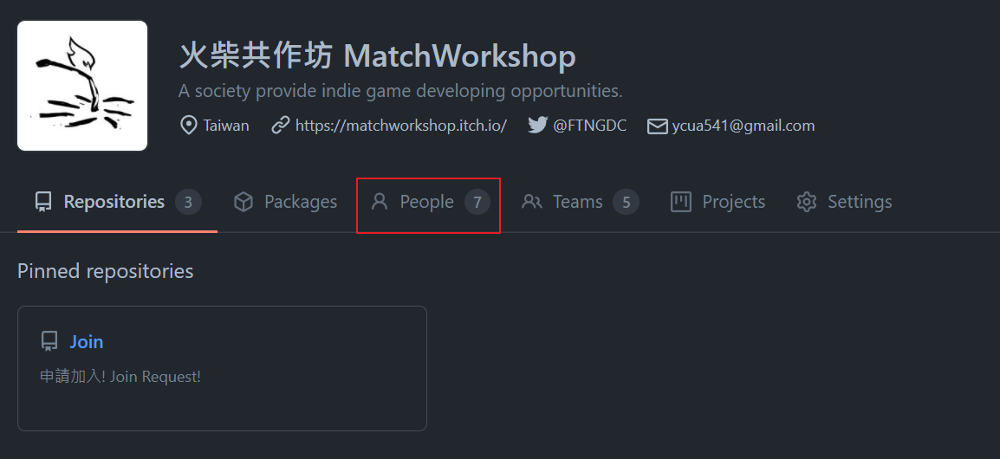
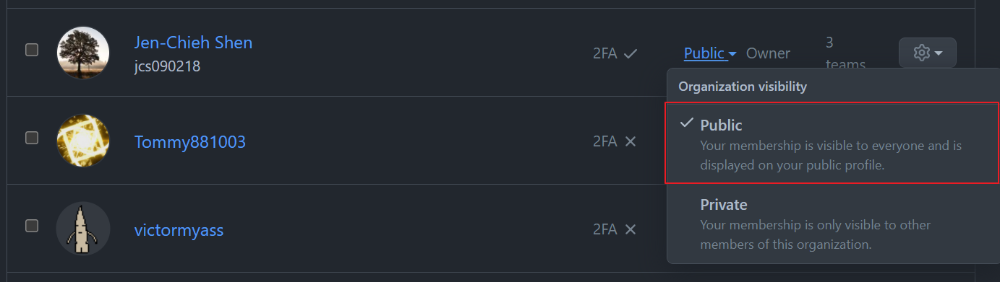

# Join

麻煩請到issue那邊開一個新的issue. 那邊會由我們的組員審核並邀請你加入!

## Checklist

以下是加入這個org以後的檢查清單.

- [ ] 確定使否已經在社群的Discord Server
- [ ] [public memeber ship](#public-membership)
- [ ] 等級考試, 確定自己是否有合格的職稱 (程式, 美術, 企劃, 音樂, etc)
- [ ] 確定是否有權限更改repo的檔案 (如果已經是其中專案的組員)

### Public Membership

GitHub的會員能見度是預設為`private`, 請把它設置為`public`.

#### :mag: 請到組織頁面並點選`People`標籤

#### :mag: 找自己的GitHub帳號並設置成`public`能見度

## License

Shield: [![CC BY-SA 4.0][cc-by-sa-shield]][cc-by-sa]

This work is licensed under a
[Creative Commons Attribution-ShareAlike 4.0 International License][cc-by-sa].

[![CC BY-SA 4.0][cc-by-sa-image]][cc-by-sa]

[cc-by-sa]: http://creativecommons.org/licenses/by-sa/4.0/
[cc-by-sa-image]: https://licensebuttons.net/l/by-sa/4.0/88x31.png
[cc-by-sa-shield]: https://img.shields.io/badge/License-CC%20BY--SA%204.0-lightgrey.svg
